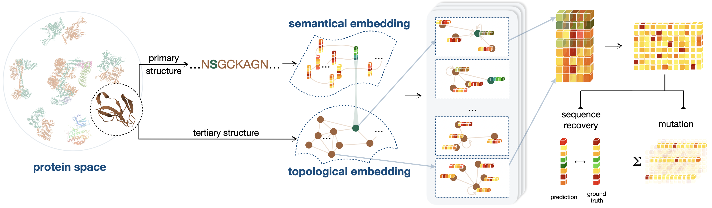
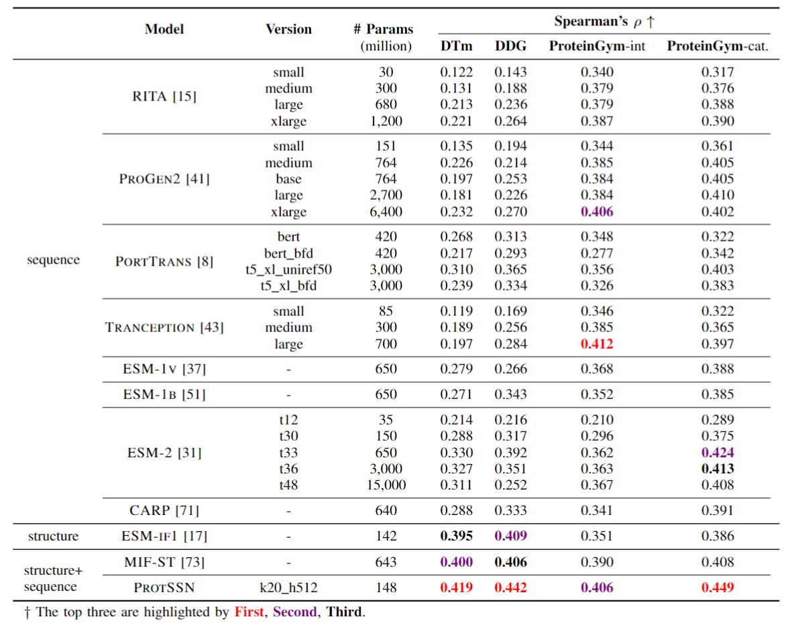
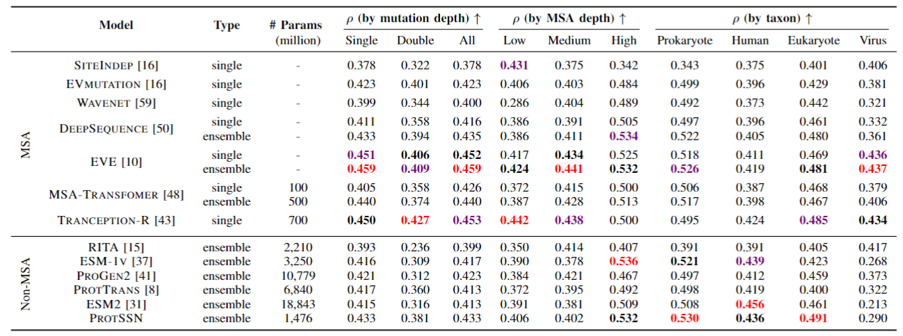

# Semantical and Topological Protein Encoding Toward Enhanced Bioactivity and Thermostability

## 🚀 Introduction (ProtSSN)

Fusion of protein **sequence and structural** information, using **denoising** pre-training network for **protein engineering** (**zero-shot**). Please note that we do not require MSA or evolutionary information.

We focus on using end-to-end methods for protein directed evolution in zero sample scenarios, our overall framework can be shown in the following figure.



## 📑 Results

### New Reults (update. 2023.12.23)

😁 Congratulations! 

Our **ensemble ProtSSN** achieved an average spearman score of **0.473** on new **ProteinGym**, and **single ProtSSN** also achieved a score of **0.465**. 

You can view and compare different baseline models on the [ProteinGym website](https://proteingym.org/benchmarks).

The pdb and csv files we checked can be downloaded from https://lianglab.sjtu.edu.cn/files/ProtSSN-2024/ProteinGym_substitutions_pdb-csv_checked.zip.

### Paper Results

We conducted tests on **ProteinGym** and compared it with the non-MSA method. Meanwhile, due to the fusion of structural information, we also conducted tests on two newly constructed stability datasets, **DTm** and **DDG**, in order to verify the correlation between structure and stability.



Our model surpasses most MSA methods and almost all language model methods **without considering viruses**, which means you can confidently use our model end-to-end. At the same time, because there is **no need for MSA** for reasoning or training, this **reduces the tedious process and prior knowledge** of collecting MSA, and there is **no potential performance instability caused by MSA** search methods/quantities.



## 🛫 Requirement

### Conda Enviroment

Please make sure you have installed **[Anaconda3](https://www.anaconda.com/download)** or **[Miniconda3](https://docs.conda.io/projects/miniconda/en/latest/)**.

**If you already have a enviroment.**

We recommend that the `torch_geometric` should been updated to 2.3 or higher.

**If you don't have a enviroment.**

```shell
conda env create -f environment.yaml
conda activate protssn
```

### Hardware

- For direct use of **inference**, we recommend at least **10G** of graphics memory, such as RTX 3080
- For **retraining** a ProtSSN, we recommend that the larger the graphics memory. We recommend a **24GB** RTX 3090 or better.

## 🧬 Zero-shot Prediction for Mutants

### Download Pre-trained Checkpoints

We have prepared 9 models that you can use separately or integrate. 😉 

If you only want to only use **one model** for reasoning, we recommend using **k20_h512**.

| # Version | # Param | # Link                                                       |
| --------- | ------- | ------------------------------------------------------------ |
| k10_h512  | 148     | https://lianglab.sjtu.edu.cn/files/ProtSSN-2024/model/protssn_k10_h512.pt |
| k10_h768  | 160     | https://lianglab.sjtu.edu.cn/files/ProtSSN-2024/model/protssn_k10_h768.pt |
| k10_h1280 | 184     | https://lianglab.sjtu.edu.cn/files/ProtSSN-2024/model/protssn_k10_h1280.pt |
| k20_h512  | 148     | https://lianglab.sjtu.edu.cn/files/ProtSSN-2024/model/protssn_k20_h512.pt |
| k20_h768  | 160     | https://lianglab.sjtu.edu.cn/files/ProtSSN-2024/model/protssn_k20_h768.pt |
| k20_h1280 | 184     | https://lianglab.sjtu.edu.cn/files/ProtSSN-2024/model/protssn_k20_h1280.pt |
| k30_h512  | 148     | https://lianglab.sjtu.edu.cn/files/ProtSSN-2024/model/protssn_k30_h512.pt |
| k30_h768  | 160     | https://lianglab.sjtu.edu.cn/files/ProtSSN-2024/model/protssn_k30_h768.pt |
| k30_h1280 | 184     | https://lianglab.sjtu.edu.cn/files/ProtSSN-2024/model/protssn_k30_h1280.pt |

```shell
mkdir model
cd model
wget https://lianglab.sjtu.edu.cn/files/ProtSSN-2024/model/protssn_k20_h512.pt
```

Ensembling models can achieve better results, and given our lower reasoning costs, you can use **ensemble methods** for zero-shot prediction. 😊

`ProtSSN.tar` contains all the model checkpoints, our **training records** and **configs** can be found in `model/history` and `model/config`.

```shell
wget https://lianglab.sjtu.edu.cn/files/ProtSSN-2024/ProtSSN.model.tar
tar -xvf ProtSSN.model.tar
rm ProtSSN.model.tar
```

### Prepare Your Own Dataset

Here is a subset of ProtetinGym as the basic sample for mutation prediction in [`data/mutant_example`](https://github.com/tyang816/ProtSSN/tree/master/data/mutant_example), the files should be arranged in the following format:

```
data/proteingym-benchmark
|——DATASET
|——|——Protein1
|——|——|——Protein1.pdb
|——|——|——Protein1.tsv
|——|——Protein2
|——|——...
```

- Because our model requires **structure (PDB)** as input, we recommend using [**Alphafold**](https://github.com/google-deepmind/alphafold) for folding, and of course, **[ESMFold](https://github.com/facebookresearch/esm)** is also a good choice.
- If you do not have a tool installed for folding protein structures, you can search for your protein by Uniprot ID in the **AlphaFold database** (https://alphafold.ebi.ac.uk/) without consuming resources for folding.

### Test on Your Own Dataset

The following script can be found at `script/zeroshot_predict.sh`, more details can be found at `zeroshot_predict.py`. We recommend using ensemble method for inference, which can be completed with a single RTX3080.

```shell
# k in (10, 20, 30)
# h in (512, 768, 1280)
# use single model for inference (default)
DATASET=proteingym-benchmark
CUDA_VISIBLE_DEVICES=0 python zeroshot_predict.py \
    --gnn_model_name k10_h512 \
    --mutant_dataset_dir data/mutant_example/$DATASET \
    --result_dir result/$DATASET


# select the models for ensemble prediction
DATASET=proteingym-benchmark
CUDA_VISIBLE_DEVICES=0 python zeroshot_predict.py \
    --gnn_model_name k10_h512 k20_h512 k30_h512 k10_h768 k20_h768 k30_h768 k10_h1280 k20_h1280 k30_h1280 \
    --use_ensemble \
    --mutant_dataset_dir data/mutant_example/$DATASET \
    --result_dir result/$DATASET
```

### Directed Evolution for Proteins Without Experimental Data

In this case, we suggest that you start from a **single point** position, and you still need to organize your protein sequence and structural files in the same way as above.

You can use the following script to construct data for **single point saturation mutations** and use models for prediction.

```shell
python src/build_sav.py -d data/mutant_example/no_exp
# output: A0A5J4FAY1_MICAE contains 14193
```

## 🔬 Get Embeddings for Analysis

Perhaps you need protein embeddings for evolutionary or other direction analysis.

### Prepare Your Own Dataset

Here is a basic sample for embedding extraction in [`data/mutant_example`](https://github.com/tyang816/ProtSSN/tree/master/data/mutant_example), the files should be arranged in the following format:
```
data/proteingym-benchmark
|——DATASET
|——|——Protein1
|——|——|——Protein1.pdb
|——|——|——Protein1.tsv (no need)
|——|——Protein2
|——|——...
```

### Start Extracting Embeddings

```shell
DATASET=proteingym-benchmark
CUDA_VISIBLE_DEVICES=0 python get_embedding.py \
    --gnn_model_name k10_h512 k20_h512 \
    --mutant_dataset_dir data/mutant_example/$DATASET \
    --result_dir result/embed/$DATASET
```

The output file is `<model>.pt` which is the following format: 

```shell
{
    protein1: {"esm_embed": esm_embed, "gnn_embed": gnn_embed}, 
    protein2: {"esm_embed": esm_embed, "gnn_embed": gnn_embed},
    ...
}
```

## ✏️ Pre-train From Scratch

### Download Pre-train Dataset

We use `CATH` for pre-training, you can find more details in https://www.cathdb.info/.

```shell
mkdir -p data/cath
cd data/cath
wget https://huggingface.co/datasets/tyang816/cath/blob/main/dompdb.tar
# or wget https://lianglab.sjtu.edu.cn/files/ProtSSN-2024/dompdb.tar
tar -xvf dompdb.tar
rm dompdb.tar
```

### Build CATH Graph (optional)

You can first create CATH graphs, but if you skip this step, the graphs will be automatically created in start training step.

see `script/build_cath_dataset.sh`

```shell
# k can be any number if you want
K=30

python src/data.py \
    --data_type cath \
    --c_alpha_max_neighbors $K \
    --cath_dataset data/cath/cath_k$K
```

### Start Training

You can view our work as an **adapter** to enhance the capabilities of language models, so you can replace any language model as a prefix.

see `script/run_pt.sh`

```shell
K=20
H=512

CUDA_VISIBLE_DEVICES=0 \
python run_pt.py \
    --seed 12345 \
    --noise_ratio 0.05 \
    --noise_type mut \
    --gnn egnn \
    --gnn_config src/config/egnn.yaml \
    --gnn_hidden_dim $H \
    --plm facebook/esm2_t33_650M_UR50D \
    --cath_dataset data/cath/cath_k$K \
    --c_alpha_max_neighbors $K \
    --learning_rate 1e-4 \
    --warmup_percent 0 \
    --weight_decay 1e-4 \
    --num_train_epochs 100 \
    --batch_token_num 1024 \
    --max_grad_norm 4 \
    --gradient_accumulation_steps 10 \
    --patience 20 \
    --model_dir debug/model/"k"$K"_h"$H
```

## 🙌 Citation

Please cite our work if you have used our code or data for **dry experiment testing/wet experiment directed evolution**. We are pleased to see improvements in the subsequent work.

```
@article{tan2023protssn,
  title={Semantical and Topological Protein Encoding Toward Enhanced Bioactivity and Thermostability},
  author={Tan, Yang and Zhou, Bingxin and Zheng, Lirong and Fan, Guisheng and Hong, Liang},
  journal={bioRxiv},
  pages={2023--12},
  year={2023},
  publisher={Cold Spring Harbor Laboratory}
}
```

